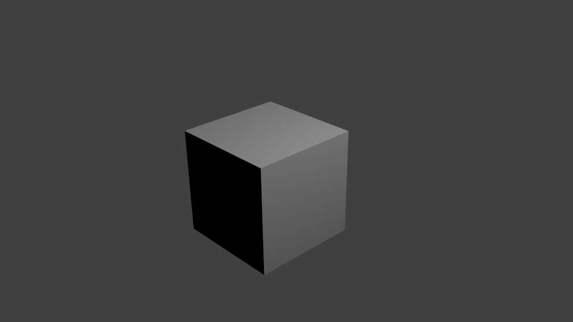
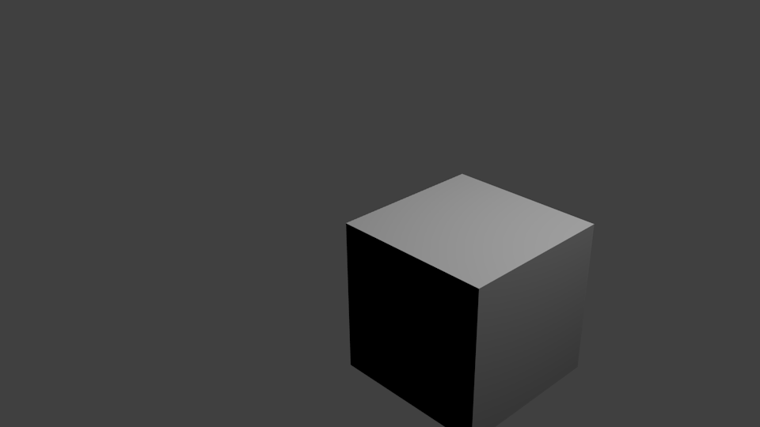
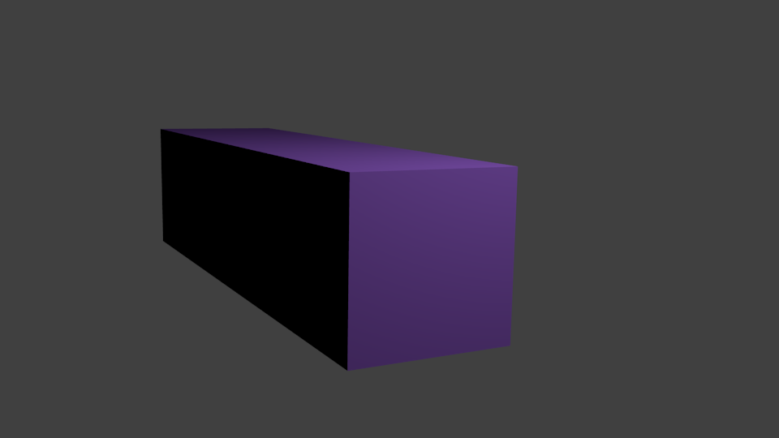
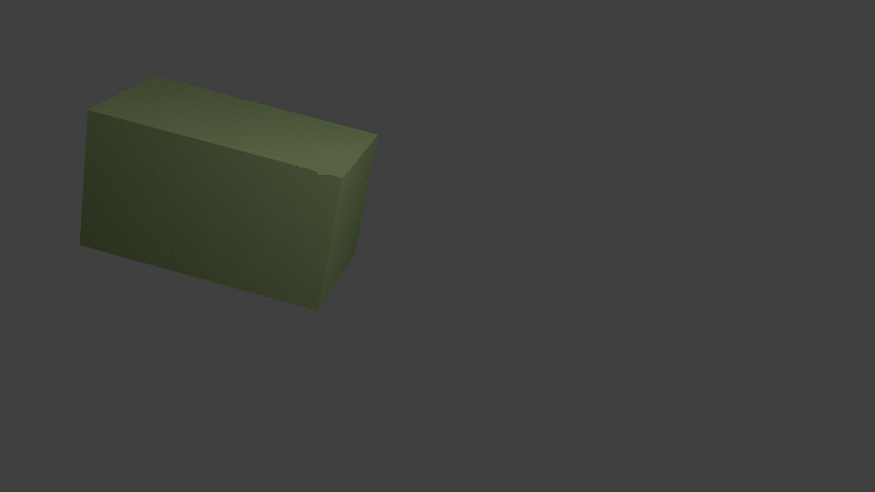
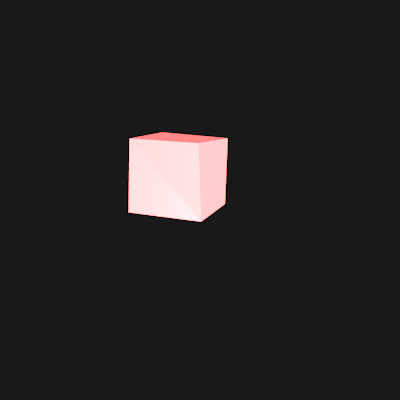

# Making gifs with Blender

Blender is a great 3D creation tool with many features. Modelling, sculpting,
animation, compositing, scripting… It’s like a treasure chest with many toys
in it.

Blender can be scripted with Python via its API. This makes it an interesting
tool for making gifs or Twitter bots!

I used it recently to create [*Clitoris
Vulgaris*](https://twitter.com/clitoscope) a Twitter bot that promotes
cliteracy! This write up lets me share my notes and learnings I made during the
project.

# Set up your scene

We will use the default Blender scene: it has a camera, a cube and a light.
Open Blender and save the default scene to `scene.blend` in a folder named
`myblendergif`. In the next section we are going to use Python to tweak and
render images.

# Launching Blender with a Python script

If you are on macOS you should alias Blender so you can use it from the
terminal.

If not there already add the following line in your `.bashrc` or `.zshrc`. It
will make it easier to call Blender from the terminal. Here is a one liner to
execute in the terminal to do it:

```bash
echo 'alias blender="/Applications/blender.app/Contents/MacOS/blender"' >> .bashrc
```

Blender has a lot of options available when running it from the terminal. Have
a look at the options by typing:

```bash
blender --help
```

What we want to do is run a Python script when the `scene.blend` has been
loaded. To do so create a Python script file `scene.py` and save it in the same
folder as your `scene.blend`. We will start with the following code:

```python
import bpy

def update_scene(scene):
    print("Hello!")

if __name__ == "__main__":
    update_scene(bpy.data.scenes[0])
```

Save it. We will now open Blender from the terminal, run the Python script and
render 1 frame. Point your terminal to folder with your `scene.blend` and
`scene.py`.

```bash
cd myblendergif
blender --background scene.blend --python scene.py --render-output botimage --render-frame 1
```

You should see the `Hello!` message in the terminal and have a
`botimage0001.png` in the folder.



# Interacting with the scene

Have a look at [Blender’s Python API
documentation](https://www.blender.org/api/blender_python_api_2_77a_release/).

You have two ways to interact with Blender: via the `bpy.data` or `bpy.ops`.
`bpy.data` lets you access everything in the scene.  `bpy.ops` lets you trigger
any action you can do in the Blender UI like clicking a button.

Today we will only use `bpy.data`.

Every object has a name that you can change in the UI. Our cube is by default
called “Cube”! Let’s access our cube and move it on the x axis by 2 unit. Edit
your `scene.py` to look like this:

```python
import bpy

def update_scene(scene):
    print("Hello!")

    cube = scene.objects["Cube"]

    # Position
    cube.location.x = cube.location.x + 2

if __name__ == "__main__":
    update_scene(bpy.data.scenes[0])
```



Similarly you could change the scale of the object on the y axis with
`cube.scale` or the rotation with `cube.rotation_euler.rotate`. Before we
continue we need to add some helper tools like `Euler` and `to_radians` in the
import section.

```python
import bpy
from math import radians as to_radians
from mathutils import Euler

def update_scene(scene):
    print("Hello!")

    cube = scene.objects["Cube"]

    # Position
    cube.location.x = cube.location.x + 2

    # Scale
    cube.scale.y = 2

    # Rotation use radians angles!
    rotate_by = Euler((to_radians(45), 0, 0), "XYZ")
    cube.rotation_euler.rotate(rotate_by)

if __name__ == "__main__":
    update_scene(bpy.data.scenes[0])
```


Let’s now change the colour of the cube. Objects have a default material that
has a diffuse colour. We will need to import the Colour object in order to
manipulate it. Colours are expressed in RGB with 3 values between 0 and 1. For
example `(0.0, 0.0, 0.0)` is pure black, `(0.8, 0.0, 0.0)` is a red and `(1.0, 1.0,
 1.0)` is pure white.

```python
import bpy
from math import radians as to_radians
from mathutils import Euler
from mathutils import Color

def update_scene(scene):
    print("Hello!")

    cube = scene.objects["Cube"]

    # Position
    cube.location.x = cube.location.x + 2

    # Scale
    cube.scale.y = 2

    # Rotation use radians angles!
    rotate_by = Euler((to_radians(45), 0, 0), "XYZ")
    cube.rotation_euler.rotate(rotate_by)

    # Colors
    cube.active_material.diffuse_color = Color((0.8, 0.0, 0.0))

if __name__ == "__main__":
    update_scene(bpy.data.scenes[0])
```

After doing a render you should see a red cube!


# Creating an animation

To create an animation we need to render more than one frame and  execute the
script for each frame.

Blender has an event system that lets us call a function before rendering a new
frame. Let’s use it to call our `update_scene` function!

```python
import bpy
from math import radians as to_radians
from mathutils import Euler
from mathutils import Color

def update_scene(scene):
    print("Hello!")

    cube = scene.objects["Cube"]

    # Position
    cube.location.x = cube.location.x + 2

    # Scale
    cube.scale.y = 2

    # Rotation use radians angles!
    rotate_by = Euler((to_radians(45), 0, 0), "XYZ")
    cube.rotation_euler.rotate(rotate_by)

    # Colors
    cube.active_material.diffuse_color = Color((0.8, 0.0, 0.0))

if __name__ == "__main__":
    bpy.app.handlers.frame_change_pre.append(update_scene)
```

Now we can use the `--frame-start` and `--frame-end` with the `--render-anim`
option when using Blender via the terminal:

```bash
blender --background scene.blend --python scene.py --render-output botimage --frame-start 1 --frame-end 12 --render-anim
```

We will get 12 images in total! But they are all the same!

## Random!

We are now going to change our script to use random values instead of
predefined values. Python has a handy function called `uniform(min, max)`. It
returns a random value between `min` and `max`!

For example if we want to move our cube on the x axis randomly between -10 and
10 units we can use `uniform(-10, 10)`. Similarly we will do the same for the
scale, rotation and colour.

```python
import bpy
from math import radians as to_radians
from mathutils import Euler
from mathutils import Color
from random import uniform

def update_scene(scene):
    print("Hello!")

    cube = scene.objects["Cube"]

    # Position
    cube.location.x = uniform(-5, 5)

    # Scale
    cube.scale.y = uniform(1, 4)

    # Rotation use radians angles!
    rotate_by = Euler((to_radians(uniform(0, 360)),
                       to_radians(uniform(0, 360)),
                       to_radians(uniform(0, 360))),
                       "XYZ")

    cube.rotation_euler.rotate(rotate_by)

    # Colors
    color_values = (uniform(0, 1), uniform(0, 1), uniform(0, 1))
    cube.active_material.diffuse_color = Color(color_values)

if __name__ == "__main__":
    bpy.app.handlers.frame_change_pre.append(update_scene)
```

Let’s render 12 frames and see what happens!



## Making a gif

We are going to use [GraphicsMagick](http://www.graphicsmagick.org/) to create
a gif from all our images. How to install it on macOS? First install
[Homebrew](http://brew.sh/) then in the terminal run `brew install
graphicsmagick`.

We want to use all the `botimageXXXX.png` and convert them to a looping gif
with a frame rate of 20 fps.

```bash
gm convert -delay 20 -loop 0 botimage*.png animation.gif
```

Open and enjoy your `animation.gif`!



Have a look at my [final version](scene.py) of the code! Hope it will inspire
you to make some nice gifs! Don’t forget to [tweet them at me](https://twitter.com/fhoehl) 😎!



# Optional: How can I use Python modules in Blender?

Blender comes with its own Python binary and modules. I recommend  using
[virtualenv](https://pypi.python.org/pypi/virtualenv) to create an environment
with the same Python version as the one used by Blender.

How to set up a `virtualenv` and install `requests`:

```bash
virtualenv -p python3 .pyenv source .pyenv/bin/activate pip install requests
```

In your `scene.py` you can then manually update the import path to let Python
find your virtualenv libraries.

```python
import sys
sys.path.append(os.path.dirname(__file__))
```
